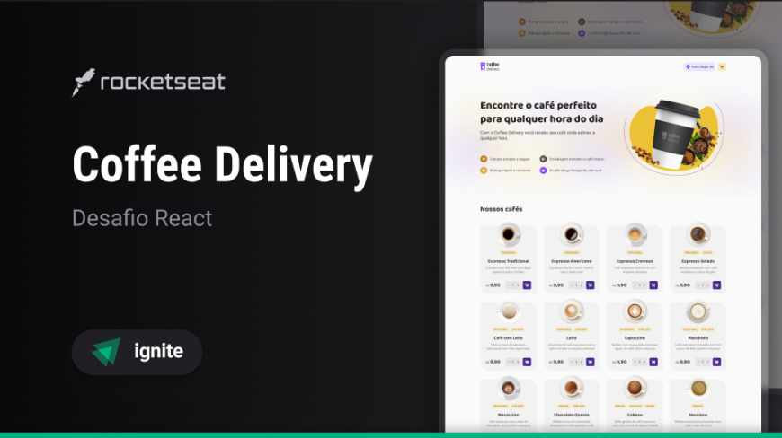

# Coffee Delivery



## Table of Contents

- [About](#about)
- [Getting Started](#getting_started)
- [Usage](#usage)
- [Technologies](#technologies)

## About <a name = "about"></a>
- This is an interface for a coffee delivery shop.
- The project was developed using React.js and TypeScript.
- The project was developed using the Vite framework.
- The application allows the user to add products to the cart, remove products from the cart, and change the quantity of the products.

## Getting Started <a name = "getting_started"></a>

These instructions will get you a copy of the project up and running on your local machine for development and testing purposes.

### Prerequisites
- You need to have Node.js installed on your machine. You can download it [here](https://nodejs.org/en/).
- You need to have a package manager installed on your machine. You can use npm, pnpm or yarn.

### Installing

A step by step series of examples that tell you how to get a development version running.

1. Clone the repository or download the zip file:
```bash
git clone https://github.com/LeonardoSPereira/Coffe-Delivery.git  
```

2. Install the dependencies: 
```bash
npm install
```

## Usage <a name = "usage"></a>

This instructions will help you to run the project on your local machine.

- With the dependencies installed, you can run the project using the following command:

```bash
npm run dev
```

## Technologies <a name = "technologies"></a>
- [React.js](https://reactjs.org/)
- [TypeScript](https://www.typescriptlang.org/)
- [Tailwind CSS](https://tailwindcss.com/)
- [Vite](https://vitejs.dev/)
- [Phosphor Icons](https://phosphoricons.com/)